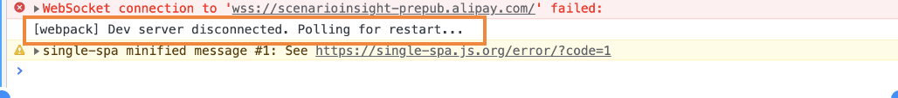
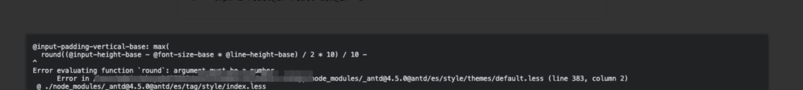

# FAQ

## Can I disable dynamicImport?

Yes, but it is not recommended to do so.

1. Install dependencies

```bash
  pnpm i babel-plugin-dynamic-import-node -D
```

2. Add `extraBabelPlugins` to the configuration, but only enable it for production

```ts
// .umirc.ts
export default {
  extraBabelPlugins: process.env.NODE_ENV === 'production'
    ? ['babel-plugin-dynamic-import-node']
    : []
}
```

## How to configure loading for dynamicImport when it's not present?

Define `src/loading.tsx`:

See [Directory Structure > loading.tsx](../guides/directory-structure#loadingtsxjsx)

## Can I use React 17?

Since Umi v4 has upgraded the default version of React to v18, be aware of compatibility between dependency libraries and React 18 when using Umi4. If you still need to use React 17, run the following commands and restart.

```bash
  pnpm add react@^17 react-dom@^17
```

## Constantly restarting and refreshing the page after proxying static resources locally



Solution: Configure `SOCKET_SERVER=127.0.0.1:${port}` to start the project

```bash
  SOCKET_SERVER=http://127.0.0.1:8000 pnpm dev
```

## Error evaluating function `round`: argument must be a number



Solution: In the new version of less, `/` is recognized as property shorthand by default. To restore the old behavior (where `/` was used as a calculation symbol by default), configure `lessLoader: { math: 'always' }`.

## The layout configuration option in routes does not take effect

The layout configuration has been moved to `app.ts`, see [Runtime Config > layout](https://umijs.org/docs/api/runtime-config#layout)

## Where did document.ejs go and how do I customize the HTML template

In addition to the injection through the configuration of external [script](https://umijs.org/docs/api/config#scripts), [css](https://umijs.org/docs/api/config#styles), you can also use the project-level plugin to more flexibly modify HTML products, see: [issuecomment-1151088426](https://github.com/umijs/umi-next/issues/868#issuecomment-1151088426)

## Why are external js files configured in scripts by default inserted after umi.js

React only starts running after the page has fully loaded, so inserting after `umi.js` will not affect the project.

If you need to insert it before `umi.js`, see [issuecomment-1176960539](https://github.com/umijs/umi/issues/8442#issuecomment-1176960539)

## How do I code split with Umi4?

Umi 4 splits code by page by default. If you feel the need for further optimization, you can use sub-package strategies or manual splitting, see: [Code Splitting Guide](../../blog/code-splitting)

If you have the requirement to pack all js products into a single `umi.js` file, please disable [dynamicImport](#can-i-disable-dynamicimport).

## Where did _layout.tsx go and how do I nest routes?

Umi 4 uses react-router v6, and nested route content is displayed through `<Outlet />`. See: [issuecomment-1206194329](https://github.com/umijs/umi/issues/8850#issuecomment-1206194329)

## How to use GraphQL

For configuring `graph-ql` loader, see: [discussions/8218](https://github.com/umijs/umi/discussions/8218)

## How to use WebAssembly

Configure as follows:

```ts
// .umirc.ts

export default {
  chainWebpack(config) {
    config.set('experiments', {
      ...config.get('experiments'),
      asyncWebAssembly: true
    })

    const REG = /\.wasm$/

    config.module.rule('asset').exclude.add(REG).end();

    config.module
      .rule('wasm')
      .test(REG)
      .exclude.add(/node_modules/)
      .end()
      .type('webassembly/async')
      .end()
  },
}
```

See an actual example: [discussions/8541](https://github.com/umijs/umi/discussions/8541)

## How to customize loaders

Depending on the scenario, you may need to exclude the file type you need to load from the static asset rules first and then add your own loader or modify it. Refer to the following examples:

 - [discussions/8218](https://github.com/umijs/umi/discussions/8218)

 - [discussions/8452](https://github.com/umijs/umi/discussions/8452)

## How to use css modules in third-party packages

1. Directly publish the source code of third-party packages' `jsx` / `ts` / `tsx` to npm, no need to translate to `js`. Umi 4 supports direct use.

2. If the third-party package output is `js`, you need to include it for additional processing by babel to support css modules:

```ts
// .umirc.ts
export default {
  extraBabelIncludes: ['your-pkg-name']
}
```

## How to solve the lack of hot updates in npm linked packages

Umi 4 has `mfsu` enabled by default and ignores changes in `node_modules` by default. Exclude the package from `mfsu` as follows:

```ts
// .umirc.ts

export default {
  mfsu: {
    exclude: ['package-name']
  },
}
```

## What is the priority order of config files for different environments?

For the detailed loading priority, see [UMI_ENV](../../docs/guides/env-variables#umi_env), and the same applies to `config/config.ts` or `.umirc.ts`.

## Problems with IE compatibility

Umi 4 is not IE compatible by default in the context of modern browsers.

If you need to adjust the build for compatibility targets, for older browsers, or for IE, please refer to [Legacy Browser Compatibility](../../blog/legacy-browser).

## SSR Issues

SSR is still an experimental feature and not recommended for production environments. If any issues are encountered, they should be reported on [issues](https://github.com/umijs/umi/issues).

## Vue / Vite Issues

Umi 4 now supports Vite mode and Vue. There may be edge cases, so report any issues on [issue](https://github.com/umijs/umi/issues).

## Why does the pathname obtained from `history` differ from the one obtained from `useLocation`?

This situation occurs when the project is configured with `base`. `history.location.pathname` reflects the browser's pathname, which includes the `base`. Route-related hooks, however, return the **frontend route** definition's pathname, which does not include the `base`. [Reference](../guides/routes#location-information).

## How to change the compression encoding format of the output

By default, the js/css compressor `esbuild` uses `ascii` encoding for compression, which may lead to the encoding of Chinese characters and increase the size of the output.

Adjust the encoding to `utf8` to prevent character conversion:

```ts
// .umirc.ts
export default {
  jsMinifierOptions: { charset: 'utf8' },
  cssMinifierOptions: { charset: 'utf8' }
}
```

Or switch the compressor to resolve this:

```ts
// .umirc.ts
export default {
  jsMinifier: 'terser',
  cssMinifier: 'cssnano'
}
```

## How to configure devServer options

Umi 4 no longer supports configuring `devServer`, but you can find alternatives as follows:

1. Use the [`proxy`](../api/config#proxy) option to set up a proxy, and modify request header information through `onProxyReq`, see [#10760](https://github.com/umijs/umi/issues/10760#issuecomment-1471158059).

2. Write a [project-level plugin](../guides/use-plugins#project-level-plugins) to insert an express middleware to modify requests, see [#10060](https://github.com/umijs/umi/issues/10060#issuecomment-1471519707).

